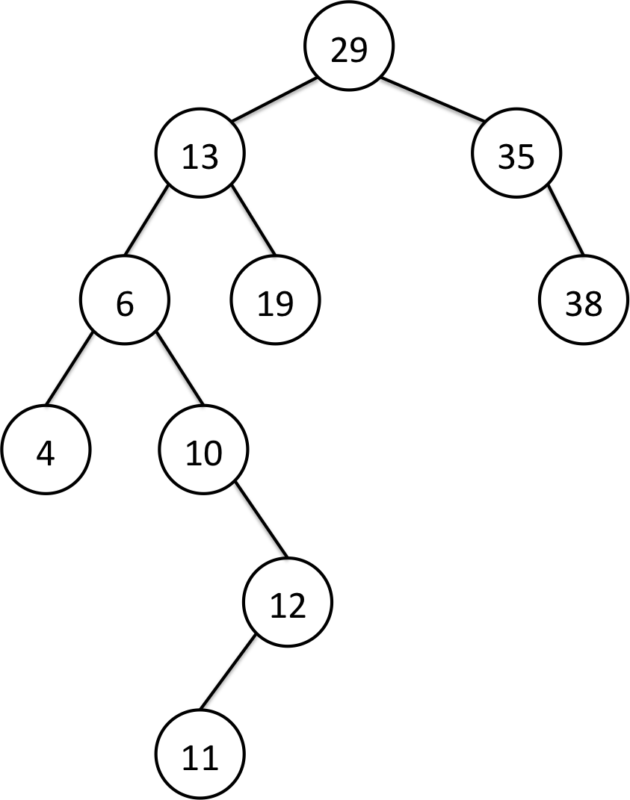
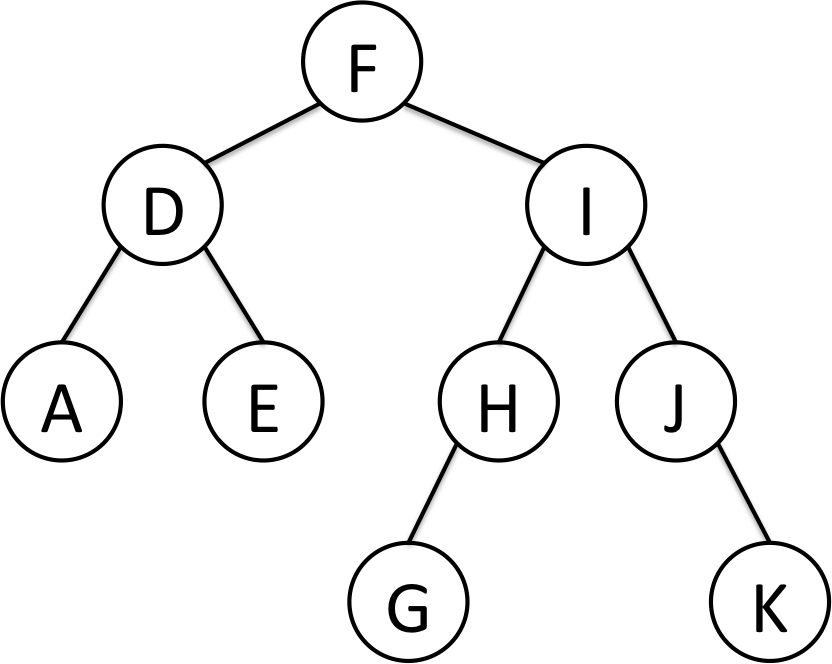

#### BSTTest.java 測試案例中，intTree之圖形




#### BSTTest.java 測試案例中，strTree之圖形



### Binary Tree Traversals (二元樹的走訪)

* Preorder traverse(前序走訪)
	> 概念: 先拜訪目前的節點，再拜訪左子樹，再拜訪右子樹。
	> 拜訪左、右子樹時，都會以相同的順序(前序)來做拜訪。
	>
	> 以下圖來做例子，順序是 A B C

* Inorder traverse (中序走訪)
	> 概念: 先拜訪左子樹，再拜訪目前的節點，再拜訪右子樹。
	> 拜訪左、右子樹時，都會以相同的順序(中序)來做拜訪。
	> 特別的是，中序走訪的結果剛好是資料從小排到大。
	> 
	> 以下圖來做例子，順序是 B A C

* Postorder traverse (後序走訪)
	> 概念: 先拜訪左子樹，再拜訪右子樹，再拜訪目前的節點。
	> 拜訪左、右子樹時，都會以相同的順序(後序)來做拜訪。
	> 
	> 以下圖來做例子，順序是 B C A

### 範例：
```
		  A
		 / \
		B   C
```
