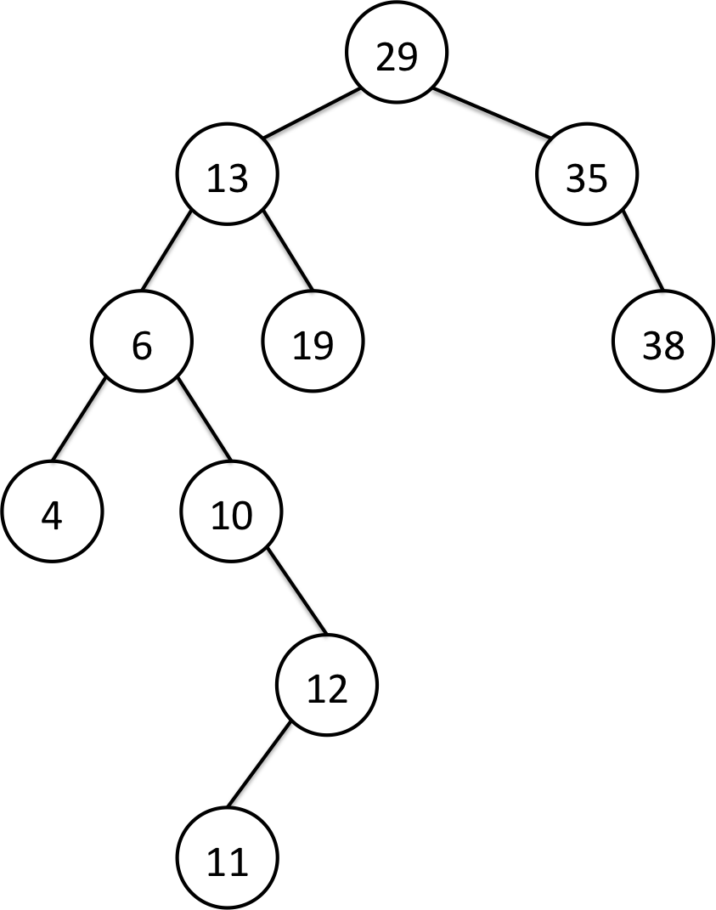
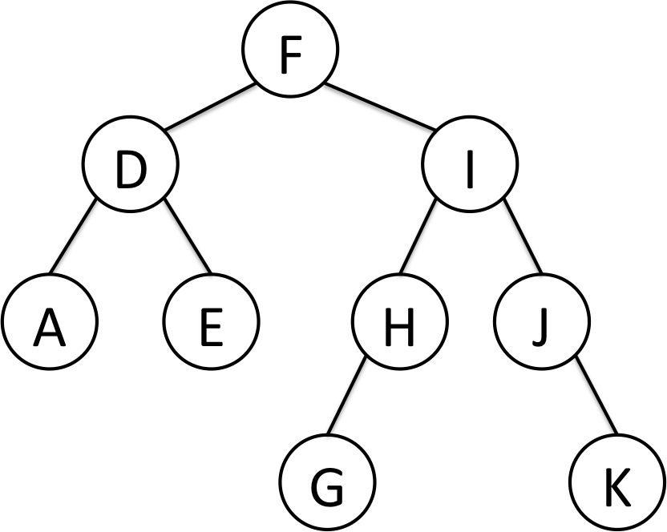

## Binary Tree (二元樹)
二元樹的每一個樹節點會儲存該節點的資料，且最多擁有兩個子樹，左子樹、右子樹

## Binary Search Tree (二元搜尋樹)
二元搜尋樹屬於二元樹，但它有一些特性，對每個節點來說，它的左子樹所有的節點資料值都小於它的資料值，右子樹所有節點資料值都大於它的資料值。
<br><br>以下intTree與strTree之圖形，就是二元搜尋樹的例子。intTree中，根節點29的左子樹的所有資料值都小於29，而右子樹的所有資料值都大於29，對其他節點亦是如此。strTree中，字串的大小是由字母順序來決定，舉例來說： `D < E` , `AB < AC`，所以根節點F的左子樹的所有資料值都小於F，右子樹所有節點值都大於F，對其他節點亦是如此。

#### BSTTest.java 測試案例中，intTree之圖形




#### BSTTest.java 測試案例中，strTree之圖形



## Binary Tree Traversals (二元樹的走訪)

* Preorder traverse(前序走訪)
	> 概念: 先拜訪目前的節點，再拜訪左子樹，再拜訪右子樹。
	> 拜訪左、右子樹時，都會以相同的順序(前序)來做拜訪。
	>
	> 以下圖範例來做例子，順序是 A B C <br>
	> 以intTree來做例子，順序是 29 13 6 4 10 12 11 19 35 38 <br>
	> 以strTree來做例子，順序是 F D A E I H G J K

* Inorder traverse (中序走訪)
	> 概念: 先拜訪左子樹，再拜訪目前的節點，再拜訪右子樹。
	> 拜訪左、右子樹時，都會以相同的順序(中序)來做拜訪。
	> 特別的是，若走訪的二元樹是**二元搜尋樹**的話，中序走訪的結果剛好是資料從小排到大。
	> 
	> 以下圖範例(非二元搜尋樹)來做例子，順序是 B A C <br>
	> 以intTree來做例子，順序是 4 6 10 11 12 13 19 29 35 38 <br>
	> 以strTree來做例子，順序是 A D E F G H I J K

* Postorder traverse (後序走訪)
	> 概念: 先拜訪左子樹，再拜訪右子樹，再拜訪目前的節點。
	> 拜訪左、右子樹時，都會以相同的順序(後序)來做拜訪。
	> 
	> 以下圖範例來做例子，順序是 B C A <br>
	> 以intTree來做例子，順序是 4 11 12 10 6 19 13 38 35 29 <br>
	> 以strTree來做例子，順序是 A E D G H K J I F 

### 範例：
```
		  A
		 / \
		B   C
```
